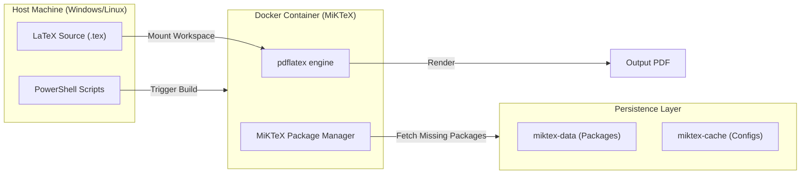

# Đánh giá và Thực hành Toàn diện về Kiểm thử Xâm nhập Hệ thống 🛡️

> **A Comprehensive Evaluation and Practice of System Penetration Testing**
>
> Dự án nghiên cứu khoa học về phương pháp luận, quy trình và thực nghiệm kiểm thử xâm nhập (Pentest) dựa trên chuẩn IEEE Conference.

[](https://www.latex-project.org/)
[](https://www.docker.com/)
[](LICENSE)
[](https://soict.hust.edu.vn/)

---

## 📖 Giới thiệu

Repo này chứa mã nguồn LaTeX và môi trường build Docker cho bài báo khoa học **"Đánh giá và Thực hành Toàn diện về Kiểm thử Xâm nhập Hệ thống"**. 

Nghiên cứu tập trung vào việc tối ưu hóa quy trình Pentest 6 giai đoạn, xây dựng mô hình đánh giá định lượng hiệu quả công cụ và thực nghiệm trên các kịch bản thực tế (Windows, Linux, Web). Hệ thống sử dụng **Dockerized MiKTeX** để đảm bảo quá trình biên dịch LaTeX đồng nhất, nhanh chóng và không phụ thuộc vào cấu hình máy cục bộ.

---

## ✨ Tính năng chính

### 🔬 Nội dung Nghiên cứu
- **Quy trình 6 giai đoạn tiêu chuẩn**: Tối ưu hóa từ khâu chuẩn bị đến khâu hậu xâm nhập và báo cáo.
- **Mô hình đánh giá định lượng**: Phương pháp phân bổ trọng số để lựa chọn công cụ Pentest tối ưu cho từng kịch bản.
- **Thực nghiệm Đa chiều**: Tái lập các cuộc tấn công (BlueKeep, EternalBlue, SQLi, XSS) trong môi trường an toàn.
- **Case Study Thực tế**: Phân tích các sự cố bảo mật lớn như Olympic Paris 2024, AT&T, Ivanti.

### 🛠️ Framework Kỹ thuật
- **Dockerized Build**: Sử dụng image `miktex/miktex:essential` giúp build PDF chỉ với 1 dòng lệnh.
- **Persistence Storage**: Sử dụng Docker Volumes để lưu trữ cache gói tin LaTeX, tăng tốc build 10x cho các lần sau.
- **VS Code Integration**: Cấu hình sẵn Recipe trong LaTeX Workshop để build trực tiếp từ IDE.
- **Automation Scripts**: Scripts PowerShell (`.ps1`) hỗ trợ quản lý container tự động.

---

## 🏗️ Kiến trúc Hệ thống

Hệ thống build sử dụng kiến trúc Containerized Workflow để cô lập môi trường LaTeX:



---

## 🚀 Cài đặt

### Yêu cầu hệ thống
- **Docker Desktop**: Để chạy môi trường MiKTeX.
- **VS Code** (Khuyên dùng): Với Extension **LaTeX Workshop**.
- **PowerShell**: Để chạy các script tự động.

### Các bước thực hiện
1. **Clone project**:
   ```bash
   git clone https://github.com/your-username/pentest-research-paper.git
   cd pentest-research-paper
   ```

2. **Cài đặt VS Code Extension**:
   Tìm và cài đặt `LaTeX Workshop` (James Yu) để tận dụng cấu hình sẵn có.

---

## 💻 Chạy Project

### Cách 1: Sử dụng VS Code (Khuyên dùng)
1. Mở file `IEEE-conference-template-062824.tex`.
2. Mở Tab **LaTeX Workshop** ở thanh sidebar.
3. Chọn build recipe: **"Docker MiKTeX (pdflatex)"**.
4. Kiểm tra file output `.pdf` trong thư mục gốc.

### Cách 2: Sử dụng Terminal (CLI)
Dành cho người dùng muốn build nhanh qua PowerShell:
```powershell
.\build_with_docker.ps1
```

> [!NOTE]
> Trong lần build đầu tiên, MiKTeX sẽ tự động tải các gói tin cần thiết (IEEEtran, amsmath, ...). Quá trình này có thể mất 3-5 phút tùy vào tốc độ mạng.

---

## ⚙️ Cấu hình Environment

Project sử dụng các Volume Docker để tối ưu hiệu năng:

| Volume Name | Mục đích | Đường dẫn trong Container |
| :--- | :--- | :--- |
| `miktex-data` | Lưu trữ các gói LaTeX đã tải | `/var/lib/miktex` |
| `miktex-cache` | Lưu trữ cache và cấu hình | `/miktex/.miktex` |

Xóa container nhưng giữ lại Volume sẽ giúp bạn không phải tải lại các gói tin ở những lần build sau.

---

## 📁 Cấu trúc thư mục

```text
.
├── .vscode/                 # Cấu hình build cho VS Code
├── fig1.png                 # Tài nguyên hình ảnh cho bài báo
├── IEEE-conference-template-062824.tex  # File source chính
├── IEEEtran.cls             # Document class chuẩn IEEE
├── IEEEtran_HOWTO.pdf       # Tài liệu hướng dẫn sử dụng template
├── build_with_docker.ps1    # Script build tự động
├── stop_container.ps1       # Script dừng container build
└── README.md                # Tài liệu hướng dẫn này
```

---

## 🤝 Đóng góp

Chào mừng mọi đóng góp cho dự án nghiên cứu này!
1. Fork dự án.
2. Tạo Brand mới (`git checkout -b feature/ResearchImprovement`).
3. Commit thay đổi (`git commit -m 'Add some research findings'`).
4. Push lên Brand (`git push origin feature/ResearchImprovement`).
5. Tạo một Pull Request.

---

## 🗺️ Roadmap

- [ ] Tích hợp BibTeX để quản lý trích dẫn tự động qua Docker.
- [ ] Chuyển đổi sang `latexmk` trong Docker để tự động build lại khi file thay đổi.
- [ ] Thêm Github Action CI/CD để tự động build PDF khi push source.
- [ ] Mở rộng thực nghiệm sang các lỗ hổng IoT/Cloud.

---

## 📜 Giấy phép

Phân phối dưới giấy phép **MIT**. Xem `LICENSE` để biết thêm chi tiết.

---

## 👥 Tác giả

Dự án được thực hiện bởi nhóm nghiên cứu tại **Đại học Bách Khoa Hà Nội (HUST)**:
- **Hoàng Quốc Trọng**
- **Ngô Công Dũng**
- **Đoàn Ngọc Minh**

---
*Copyright © 2024 Hanoi University of Science and Technology*
